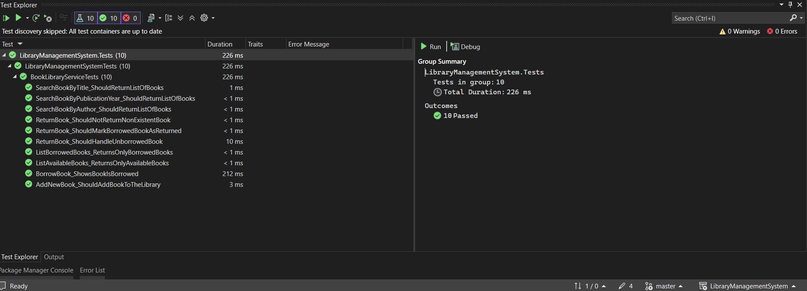

Library Management System - README

**``Overview``**

---

A simple console application as a Library Management System developed in .NET 9.

## 🚀 Quick Start

1. Clone the repo:
   ```
   git clone https://github.com/Nugasnakarmi/LibraryManagementSystem.git
   ```

2. Run the app:
	In a terminal or shell run:
   ```
	dotnet run
   ```	
	Or, In Visual Studio, open the LibraryManagementSystem.soln file, and press on run button.
You may need to select the LibraryManagementSystem solution by clicking the cog button in the toolbar to choose between the test solution and the LMS.


**``Explanation of technology choices``**

---

1. .NET 9.0 is the latest .NET STS version, it has Cross-platform support (Windows, Linux, macOS) and better performance than LTS versions.
2. xUnit Testing framework which has modern syntax for eg: [Fact] over [TestMethod], cleaner assertions and better testing performance.
3. Dependency Injection - Constructor injection pattern which follows modern .NET DI pattern and helps in easier use of services and testing.
4. Visual Studio was used to develop the console application

**`Testing`**

Unit testing can be done by a simple:
```
dotnet test 
```
You can also right click on the unit test project - LibraryManagementSystem.Tests and select 'Run Tests'.

